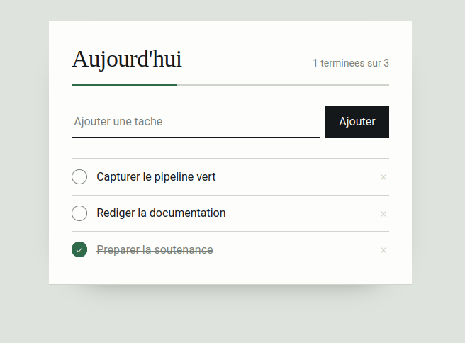
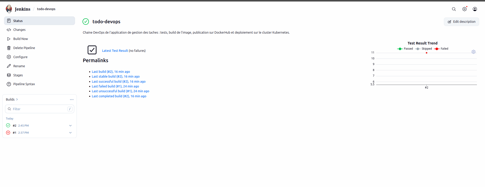
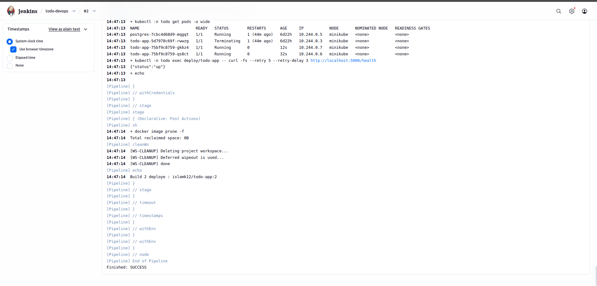
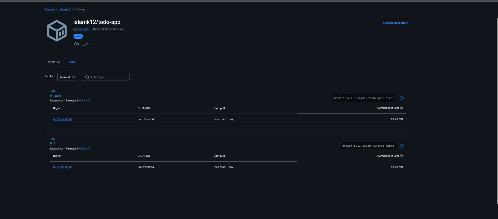
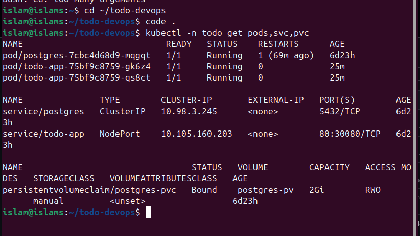
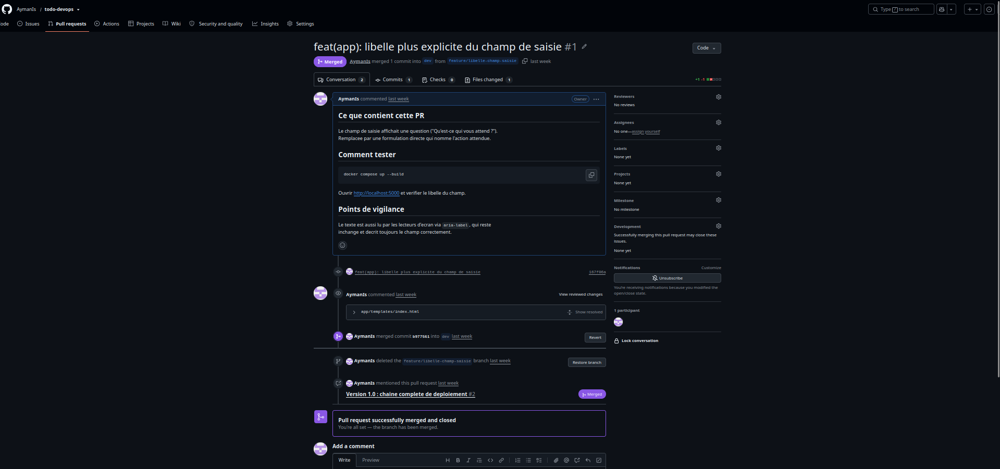
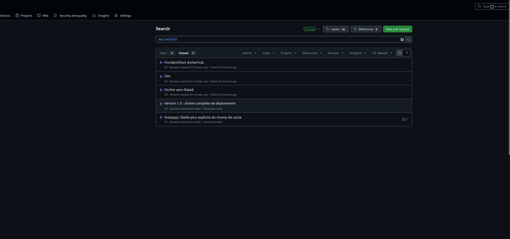

# Deploiement automatise d'une application web de gestion des taches

Chaine DevOps complete autour d'une liste de taches : provisionnement des machines
avec Terraform, configuration avec Ansible, integration continue avec Jenkins,
deploiement sur Kubernetes.

Universite Hassan II - Faculte des Sciences Ain Chock
Departement Mathematiques et Informatique

---

## Principe

```
   Poste de travail            VM 1 - Jenkins              VM 2 - Kubernetes
   ----------------            --------------              -----------------
   git push  --> GitHub -----> Clone
                 webhook       Tests (pytest)              NGINX :80
                               Build image Docker              |
                               Push --> DockerHub --------> Service NodePort :30080
                               kubectl apply -------------> Deployment todo-app (x2)
                                                                |
                                                           Service postgres :5432
                                                                |
                                                           PVC --> PersistentVolume
```

L'application affiche les taches du jour, la part deja terminee, et permet d'ajouter,
cocher ou supprimer une tache. Les donnees vivent dans PostgreSQL, adosse a un volume
persistant : les pods peuvent disparaitre, les taches restent.

## Arborescence

```
.
├── app/                    application Flask
│   ├── app.py              routes et fabrique d'application
│   ├── store.py            acces aux donnees : Postgres + implementation memoire
│   ├── templates/ static/  interface
│   ├── tests/              11 tests unitaires, aucune base requise
│   └── Dockerfile
├── infra/
│   ├── terraform/          les 2 VM, le reseau, les cles, l'inventaire Ansible
│   └── ansible/            roles base, jenkins, kubernetes, postgres, nginx
├── k8s/                    manifests numerotes dans l'ordre d'application
├── ci/jenkins/             image Jenkins outillee (docker, kubectl, python3-venv)
├── githooks/               pre-commit et commit-msg
├── docs/
│   ├── workflow-git.md     branches, commits, hooks
│   ├── pull-request.md     la revue commentee
│   └── captures/           preuves d'execution
├── Jenkinsfile             pipeline declaratif
└── docker-compose.yml      environnement local
```

Deux choix expliquent le reste du projet :

- `store.py` est separe de `app.py`. La meme interface a deux implementations, dont une
  en memoire : les tests tournent dans Jenkins sans base de donnees, en une seconde.
- L'image est etiquetee avec le numero de build. Chaque deploiement est tracable et le
  retour arriere tient en une commande.

## Prerequis

Terraform 1.5, Ansible 2.15, Docker 24, kubectl 1.29, Python 3.11.
Un compte DockerHub et un depot GitHub pour la partie CI/CD.

---

## 1. Voir l'application tourner

```bash
git clone https://github.com/<votre-compte>/todo-devops.git
cd todo-devops
docker compose up --build
```

Interface sur <http://localhost:5000>, sonde de sante sur `/health`.

Les tests, sans rien installer d'autre :

```bash
cd app
python3 -m venv .venv && ./.venv/bin/pip install -r requirements-dev.txt
TODO_BACKEND=memory INIT_SCHEMA=0 ./.venv/bin/pytest
```

## 2. Creer les deux machines (Terraform)

```bash
cd infra/terraform
cp terraform.tfvars.example terraform.tfvars    # region, ip_admin, cle SSH
terraform init
terraform plan
terraform apply
```

Deux instances Ubuntu 22.04, leurs groupes de securite et la paire de cles SSH.
Terraform ecrit aussi `infra/ansible/inventory.ini` : aucune adresse IP a recopier.

```
jenkins_ip      = "13.36.x.x"
kubernetes_ip   = "15.188.x.x"
url_jenkins     = "http://13.36.x.x:8080"
url_application = "http://15.188.x.x"
```

## 3. Configurer les machines (Ansible)

```bash
cd infra/ansible
ansible-galaxy collection install -r requirements.yml
ansible all -m ping
ansible-playbook site.yml
```

| Role | Ce qu'il installe |
|---|---|
| `base` | Paquets de base, Docker, desactivation du swap sur la VM Kubernetes |
| `jenkins` | Java 17, Jenkins, kubectl, affichage du mot de passe initial |
| `kubernetes` | kubectl, minikube, demarrage du cluster, kubeconfig pret pour Jenkins |
| `postgres` | PostgreSQL, base et utilisateur du projet |
| `nginx` | Reverse proxy du port 80 vers le NodePort 30080 |

Chaque role porte une etiquette, ce qui evite de tout rejouer :

```bash
ansible-playbook site.yml --limit kubernetes --tags k8s
```

## 4. Brancher Jenkins

1. Ouvrir `http://<jenkins_ip>:8080` et coller le mot de passe affiche par le playbook.
   Installer les plugins suggeres, puis **Docker Pipeline**, **Kubernetes CLI**, **Git**.
2. Recuperer le kubeconfig genere sur la VM Kubernetes :
   ```bash
   scp ubuntu@<kubernetes_ip>:~/kubeconfig-jenkins.yaml .
   ```
3. Dans **Manage Jenkins > Credentials > System > Global**, creer :

   | ID | Type | Contenu |
   |---|---|---|
   | `dockerhub-creds` | Username with password | identifiants DockerHub |
   | `kubeconfig` | Secret file | `kubeconfig-jenkins.yaml` |

4. **New Item > Pipeline** nomme `todo-app` : *Pipeline script from SCM*, Git, branche
   `*/main`, script path `Jenkinsfile`, case *GitHub hook trigger* cochee.
5. Dans GitHub, **Settings > Webhooks** : `http://<jenkins_ip>:8080/github-webhook/`,
   content type `application/json`.

Avant le premier build, remplacer la valeur de `DOCKERHUB_USER` en haut du
`Jenkinsfile` par votre identifiant DockerHub. Le compte utilise ici est `islamk12` :
le `docker push` n'est accepte que sous le compte auquel appartient le jeton
d'authentification.

### Variante locale, celle qui a servi a la demonstration

Faute de credits cloud, les deux VM n'ont pas ete provisionnees : Jenkins et le cluster
tournent sur le poste de travail. Le code Terraform reste dans le depot et passe
`terraform validate` ; seule son application est absente.

Jenkins tourne dans un conteneur construit depuis `ci/jenkins/Dockerfile`. L'image
officielle ne fournit que `git` : le pipeline a besoin en plus de `python3-venv` pour
les tests, du client Docker pour le build, et de `kubectl` pour le deploiement.

```bash
docker build --build-arg DOCKER_GID=$(getent group docker | cut -d: -f3) \
    -t todo-jenkins:lts ci/jenkins

docker volume create jenkins_home
docker run -d --name jenkins \
    --network minikube --ip 192.168.49.10 \
    -p 8080:8080 -p 50000:50000 \
    -v jenkins_home:/var/jenkins_home \
    -v /var/run/docker.sock:/var/run/docker.sock \
    -e JAVA_OPTS="-Xmx1g" \
    todo-jenkins:lts
```

Trois points meritent une explication.

**Le groupe Docker.** Le socket `/var/run/docker.sock` appartient au groupe `docker` de
l'hote. L'utilisateur `jenkins` doit appartenir au meme identifiant de groupe pour
dialoguer avec le demon, d'ou l'argument `DOCKER_GID`.

**Le reseau.** Jenkins est attache au reseau `minikube` afin de joindre l'API Kubernetes
sur `192.168.49.2:8443`. L'adresse fixe `192.168.49.10` est indispensable : sans elle,
Jenkins redemarre avant minikube apres un reboot et occupe `192.168.49.2`, l'adresse
reservee au noeud, ce qui empeche le cluster de demarrer.

**Le kubeconfig.** Celui de minikube reference des certificats sur le disque de l'hote,
absents du conteneur. On l'aplatit avant de l'importer comme *secret file*, ce qui
embarque les certificats dans le fichier :

```bash
kubectl config view --flatten --minify --raw > kubeconfig-jenkins.yaml
```

## 5. Le pipeline

| Etape | Action |
|---|---|
| Checkout | Recuperation du depot, affichage du dernier commit |
| Tests unitaires | `flake8` puis `pytest` sur le store memoire, rapport JUnit publie |
| Build image Docker | Construction, etiquetage `:<numero de build>` et `:latest` |
| Push vers DockerHub | Connexion par `--password-stdin`, envoi des deux tags |
| Deploiement | `kubectl apply`, substitution de `__IMAGE__`, attente du rollout |
| Verification | Etat des pods et appel de `/health` dans le conteneur |

Retour a la version precedente :

```bash
kubectl -n todo rollout undo deploy/todo-app
```

## 6. Kubernetes

| Fichier | Objet | Role |
|---|---|---|
| `00-namespace.yaml` | Namespace | Isole les ressources du projet |
| `01-secret.yaml` | Secret | Identifiants de la base |
| `02-configmap.yaml` | ConfigMap | Parametres non sensibles |
| `03-postgres-pv.yaml` | PV + PVC | 2 Gi persistants |
| `04-postgres.yaml` | Deployment + Service | Base de donnees, strategie `Recreate` |
| `05-app-deployment.yaml` | Deployment | 2 replicas, sondes, mise a jour progressive |
| `06-app-service.yaml` | Service NodePort | Exposition sur le port 30080 |

En dehors du pipeline :

```bash
kubectl apply -f k8s/00-namespace.yaml -f k8s/01-secret.yaml -f k8s/02-configmap.yaml
kubectl apply -f k8s/03-postgres-pv.yaml -f k8s/04-postgres.yaml -f k8s/06-app-service.yaml
sed 's|__IMAGE__|moncompte/todo-app:latest|' k8s/05-app-deployment.yaml | kubectl apply -f -
kubectl -n todo get pods,svc,pvc
```

Sur un cloud manage, `type: LoadBalancer` remplace le NodePort dans
`06-app-service.yaml` et la StorageClass du fournisseur remplace le PV manuel.

La demonstration qui convainc un jury tient en trois commandes : ajouter une tache
depuis l'interface, supprimer le pod de la base, constater que la tache est toujours la.

```bash
kubectl -n todo delete pod -l app=postgres
kubectl -n todo get pods -w
```

## Preuves d'execution

Les captures ci-dessous ont ete prises sur la chaine reellement deployee.

### L'application servie par le cluster



Servie par les deux replicas via le service NodePort, sur `http://192.168.49.2:30080`.

### Le pipeline Jenkins



Le build #1 est rouge, le #2 vert. L'echec n'est pas masque : il a revele que l'agent
Jenkins tourne sous Python 3.13 alors que le poste de travail utilise Python 3.12, et
que `psycopg2-binary` 2.9.9 ne publie pas de paquet precompile pour cette version. La
dependance a ete relevee en 2.9.10. C'est le role d'une chaine d'integration que de
rendre visible ce genre d'ecart entre environnements.



Fin du build #2 : `Finished: SUCCESS`. On y voit le remplacement progressif des pods,
un ancien en `Terminating` pendant que les deux nouveaux repondent deja, puis l'appel
de `/health` depuis l'interieur d'un conteneur qui renvoie `{"status":"up"}`.

### L'image publiee



Les etiquettes `2` et `latest` partagent le digest `fa32e6b3d19b`, celui que le journal
du build affiche apres le push. Le numero de build Jenkins sert d'etiquette : le lien
entre un build et ce qui tourne sur le cluster est verifiable.

### L'etat du cluster



Trois pods prets, le service NodePort, et le volume persistant `Bound` sur 2 Gio. Les
ages se lisent : les pods applicatifs datent du dernier build, la base tourne depuis
plusieurs jours. Le calcul est jetable, l'etat ne l'est pas.

### La gestion Git



Pull request #1 : une description structuree, un commentaire de revue depose sur le
diff, une reponse, la conversation resolue, puis une fusion en squash et la suppression
de la branche.



Cinq pull requests fusionnees. La branche `main` est protegee par un ruleset qui impose
le passage par une pull request et interdit la suppression comme le push force.

## Git

```bash
bash githooks/install-hooks.sh
```

`pre-commit` lance le lint et les tests avant chaque commit, `commit-msg` refuse les
messages hors format `type(portee): description`. Le detail des branches est dans
[docs/workflow-git.md](docs/workflow-git.md), la pull request relue et validee dans
[docs/pull-request.md](docs/pull-request.md).

## Depannage

**Pod `postgres` en `CrashLoopBackOff`** : le point de montage n'etait pas vide.
`PGDATA` doit pointer sur un sous-repertoire, voir `04-postgres.yaml`.

**Pods `todo-app` bloques en `0/1 Running`** : la sonde `/health` echoue tant que la base
n'est pas prete. `kubectl -n todo logs -l app=todo-app` montre les dix tentatives de
connexion.

**`docker: permission denied` dans Jenkins** : l'utilisateur vient d'entrer dans le
groupe `docker`, `sudo systemctl restart jenkins`.

**Certificat refuse depuis Jenkins** : cluster demarre sans `--apiserver-ips`.
`minikube delete` puis `ansible-playbook site.yml --limit kubernetes --tags k8s`.

**`ImagePullBackOff`** : le tag n'existe pas encore sur DockerHub, ou le depot est prive.

## Nettoyage

```bash
kubectl delete namespace todo
cd infra/terraform && terraform destroy
```
